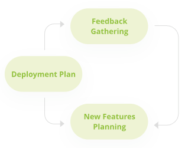

# Going Live

## Scaling and Polishing 

This is the phase in which the team deploys and review possible improvements. We analyze the work, looking for ways to improve and seeking out opportunities for enhancement based on user feedback. We set to work detecting the need for any specific features.

