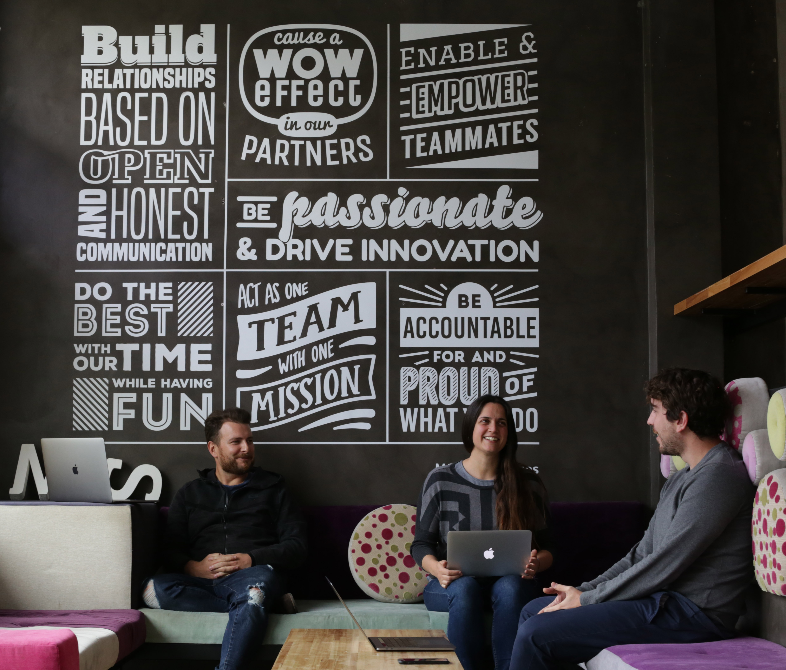

# Core Values

If something matters here, are our core values. We believe in the importance of share them, and we try at every time reflect them in our actions.

## Cause a Wow Effect on our Partners

We want to blow our partners’ mind when they deal with us, preferably at the beginning of the relationship, so we are positioned to grow. We want to cause a“WOW” effect on our clients, we want them to be impressed by our high quality of service and surprised by unexpected actions that have a positive impact. We want them to see, from the beginning, that we will add value to his company, not only doing what is required or expected, but also by going the extra mile.

## Act as one team with one missiom

We want our entire organization and team members to be aligned with our mission, vision and values. “One team” members collaborate and learn together, share wins and losses. “Individual commitment to a group effort – that is what makes a team work, a company work, a society work, a civilization work.” \(Quote from Vince Lombardi, coach of the Green Bay Packers during the 1960s\)

## Enable and empower teammates

We are not superheroes, we need our team to support us. Trust them, help them, work together. Don’t leave teammates behind, enable them by lending a hand to help them accomplish things they could not do by themselves. And help them learn so they empower themselves by acquiring the means to take more control and become stronger and more independent.

## Build relationshops based on empathy and opne/honest communication

Honesty and openness help build trust and compatibility. When we and our clients openly reveal the facts of our past, our present activities, and our plans for the future, we are able to make intelligent decisions that take each other's needs into account, thus creating a win-win situation.

## Be passionate and drive innovation

If we want to be successful we need to be passionate about our work. We need to be motivated and driven to be the best we can be regardless of what our job is. Passion, drive, motivation, zeal, is the self-driven attitude about our job and our work that can help lead us down the path to success.

And we want to focus this passion on creating a competitive advantage by always thinking about innovative ways to achieve what our clients need. By doing so, we differentiate ourselves from other companies that do similar work, and this helps us grow by winning business and securing partnerships.

## Do the best with your time while having fun

We want to be productive in a way that allows us to enjoy our work. We spend many hours working, we need to spend them in a smart way: Setting priorities, focusing on the important stuff, scheduling meetings and specific activities on our calendars. By working smart, we can find time to relax and have fun without losing focus on our objectives.

## Be accountable for and proid of what you do

We should “own” our assignments and feel responsible for our results. When we are personally accountable, we stop assigning blame, “should-ing” on people, and making excuses. Instead, we take the fall when our choices cause problems.

And at the end of each day we want to feel proud of what we achieved, knowing that we have done our best dealing with both, things that we can control, and things that we cannot.

