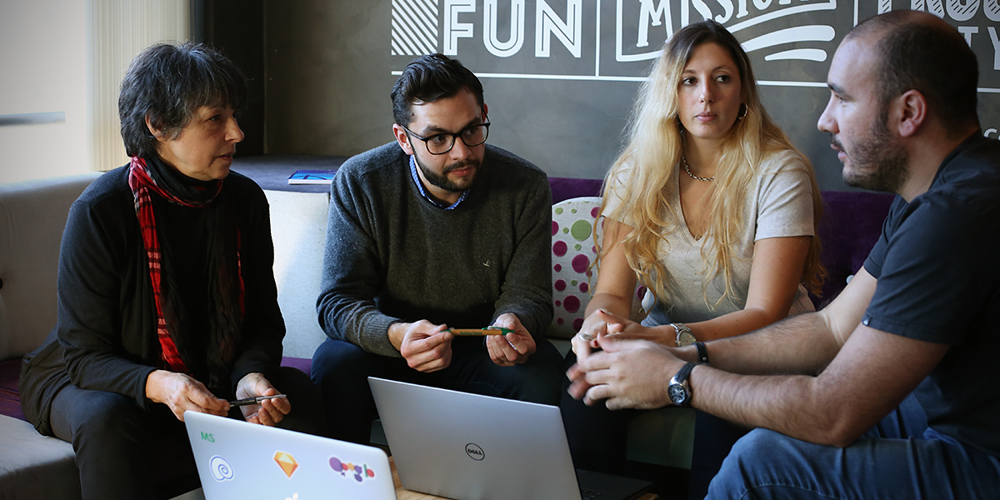

# Project Management Department

### Our Purpose

Our mission is to deliver products on budget, on time, and with the scope and quality agreed upon with our client. We have years of experience and the flexibility to customize our methodology to meet client needs, in a way that serves Making Sense’s business objectives. Our project teams include client staff such as product owner and users. We strive to build positive relationships and align expectations.

### Area Lead 

​ **Silvia Vassolo**, Head of PM


See more about the PM Department at   
[http://confluence.makingsense.com/display/PS](http://confluence.makingsense.com/display/PS)


